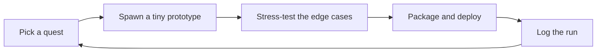

  

  

  

  <h1>🕹️ IROHA.SAV — Character Profile</h1>

  

   

  
  
  
  

 

Save file loaded. A software developer who keeps three save slots open at once —
**mobile** (Kotlin / Jetpack Compose), **backend** (Python / FastAPI), and
**cloud** (Docker / Kubernetes / GCP) — with a side-quest habit of poking at
computer vision and OCR. Open to software development, mobile/backend, cloud,
QA, and computer vision opportunities.

## 🎒 Item Box

<table>
<tr><td><b>Languages</b></td><td>
  
  
  
  
  
</td></tr>
<tr><td><b>App &amp; API</b></td><td>
  
  
  
  
  
</td></tr>
<tr><td><b>Cloud &amp; DevOps</b></td><td>
  
  
  
  
  
  
  
</td></tr>
<tr><td><b>Testing &amp; Quality</b></td><td>
  
  
  
  
  
</td></tr>
<tr><td><b>Data &amp; Vision</b></td><td>
  
  
  
  
</td></tr>
</table>

## 📜 Quest Log

**★ Main Quest — Cloud-Native YOLO Detection Service**

Built a FastAPI inference service that accepts Base64 images, runs YOLOv8
object detection, packages the service into a CPU-only Docker image, and
deploys it on GCP Kubernetes. Terraform and Ansible handled the infra setup;
Locust load tests across different pod counts mapped out the scaling limits.

**Stack:** `Python` · `FastAPI` · `YOLOv8` · `Docker` · `Kubernetes` · `Terraform` · `Ansible` · `GCP` · `Locust`

---

**◆ Side Quest — Android OCR Expiry-Date Scanner**

An Android app that extracts expiry dates from images. The pipeline cleans
up OCR output, handles common recognition mixups like `O/0` and `I/1`, and
matches multiple date formats with regex.

**Stack:** `Kotlin` · `Jetpack Compose` · `ML Kit Text Recognition` · `Regex` · `Git`

---

**◆ Side Quest — Java Reservation System QA Improvement**

Improved unit test coverage for reservation, passenger information, and
flight query logic. Added mutation and coverage analysis, then used CI and
quality gates to surface risk before it could hide in the codebase.

**Stack:** `Java` · `Maven` · `JUnit 5` · `Mockito` · `PIT` · `JaCoCo` · `SonarQube` · `GitLab CI/CD`

## 📊 Save Stats

<table>
<tr>
<td>
  <picture>
    <source media="(prefers-color-scheme: dark)" srcset="https://github-readme-stats.vercel.app/api?username=Ying-IROHA&show_icons=true&hide_border=true&bg_color=00000000&title_color=FF86B1&icon_color=4FE0BC&text_color=F5E9F5&ring_color=FFD666" />
    
  </picture>
</td>
<td>
  <picture>
    <source media="(prefers-color-scheme: dark)" srcset="https://github-readme-streak-stats.herokuapp.com/?user=Ying-IROHA&background=00000000&border=2E2440&ring=FF86B1&fire=FFD666&currStreakLabel=F5E9F5&sideLabels=F5E9F5&currStreakNum=F5E9F5&sideNums=F5E9F5&dates=B8A8CC" />
    
  </picture>
</td>
</tr>
</table>

## 🐍 Contribution Snake

  <picture>
    <source media="(prefers-color-scheme: dark)" srcset="https://raw.githubusercontent.com/Ying-IROHA/Ying-IROHA/output/pixel-snake-dark.svg" />
    
  </picture>

## 🔁 Respawn Loop

<b>Player Notes</b>

 

- Start with the smallest save state that proves the run can work.
- Treat tests, deployment, and documentation as part of the main quest, not side content.
- Make failure states visible instead of hiding them behind happy paths.
- Prefer practical tools and readable code over clever one-liners.
- Keep grinding XP across software engineering, cloud systems, and interactive technology.

 

  Open to software development, mobile/backend, cloud, QA, and computer vision opportunities. 
  Built with a taste for pixels, tiny quests, and well-tested systems.

  

<!--
Privacy note for future edits:
Keep this profile focused on public work, technical strengths, and working style.
Avoid adding phone numbers, private email addresses, exact addresses, student IDs,
API keys, account IDs, room IDs, or screenshots containing personal information.
-->
