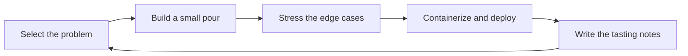

 

  
  
  
  

---

## The House Pour

I'm **Xiyu Cao**, a software developer with a Master of Information Technology
background at Monash University and a Game Engineering foundation from Newcastle
University. My work blends mobile apps, backend services, cloud deployment,
computer vision, and software quality.

I like the point where an idea becomes usable: the prototype runs, the edge cases
are visible, the deployment story makes sense, and the system can explain itself
without a long apology.

## Tasting Notes

| Note | Profile |
| :--- | :--- |
| **Mobile Finish** | Kotlin, Jetpack Compose, Android flows, OCR interaction design |
| **Backend Body** | Python, FastAPI, REST APIs, image-processing services |
| **Cloud Aroma** | Docker, Kubernetes, Terraform, Ansible, GCP, Linux |
| **Quality Structure** | JUnit, Mockito, PIT, JaCoCo, CI/CD, code quality analysis |

## Featured Bottles

### Cloud-Native YOLO Detection Service

**Python · FastAPI · YOLOv8 · Docker · Kubernetes · Terraform · Ansible · GCP · Locust**

Built a FastAPI inference service that accepts Base64 images, runs YOLOv8 object
detection, packages the service into a CPU-only Docker image, and deploys it on
GCP Kubernetes. Used Terraform and Ansible for infrastructure setup, then ran
Locust load tests across different pod counts to reason about scaling limits.

### Android OCR Expiry-Date Scanner

**Kotlin · Jetpack Compose · ML Kit Text Recognition · Regex · Git**

Created an Android app that extracts expiry dates from images. The pipeline
cleans OCR output, handles common recognition mistakes such as `O/0` and `I/1`,
and matches multiple date formats with regex.

### Java Reservation System QA Improvement

**Java · Maven · JUnit 5 · Mockito · PIT · JaCoCo · SonarQube · GitLab CI/CD**

Improved unit test coverage for reservation, passenger information, and flight
query logic. Added mutation and coverage analysis, then used CI and quality
checks to surface risk before it could hide in the codebase.

## Cellar

| Category | Tools |
| :--- | :--- |
| **Languages** | `Java` · `Kotlin` · `Python` · `R` · `SQL` |
| **App & API** | `Android Development` · `Jetpack Compose` · `FastAPI` · `Maven` · `REST API` |
| **Cloud & DevOps** | `Docker` · `Kubernetes` · `Terraform` · `Ansible` · `GCP` · `Linux` · `GitLab CI/CD` |
| **Testing & Quality** | `JUnit` · `Mockito` · `PIT` · `JaCoCo` · `SonarQube` · `Mutation Testing` |
| **Data & Vision** | `Data Analysis` · `RMarkdown` · `ML Kit OCR` · `YOLOv8` · `Computer Vision` |

## Service Ritual

<b>Sommelier's Notes</b>

 

- Start with the smallest version that proves the system can work.
- Treat tests, deployment, and documentation as part of the product.
- Make failure cases visible instead of hiding them inside happy paths.
- Prefer practical tools and readable code over cleverness for its own sake.
- Keep learning across software engineering, cloud systems, and interactive technology.

---

  Open to software development, mobile/backend, cloud, QA, and computer vision opportunities. 
  Built with a taste for clarity, deployable prototypes, and well-tested systems.

<!--
Privacy note for future edits:
Keep this profile focused on public work, technical strengths, and working style.
Avoid adding phone numbers, private email addresses, exact addresses, student IDs,
API keys, account IDs, room IDs, or screenshots containing personal information.
-->
