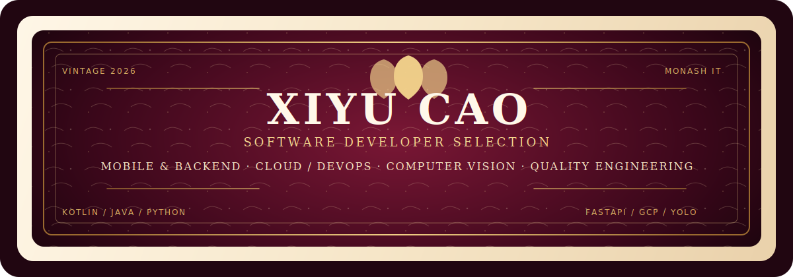
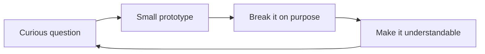

<div align="center">
  
</div>

<br />

```text
> incoming transmission...

  curiosity     ███████████████████░  95%
  prototyping   █████████████████░░░  85%
  tidy systems  ███████████████░░░░░  75%
  sleep         ██████░░░░░░░░░░░░░░  negotiable
```

### Hi, I'm the human behind this terminal 👋

I like turning slightly odd ideas into small systems that actually run.
Right now, that usually means **AI experiments**, **Python automation**,
**software quality**, and tools that make complicated material easier to understand.

I care about the last 10%: sensible failure modes, readable explanations,
and the tiny details that make a prototype feel alive instead of merely functional.

### Current coordinates

| Signal | What I'm exploring |
| :--- | :--- |
| `LIVE` | An AI virtual-host pipeline: live chat → character response → speech |
| `BUILD` | Python tools that turn messy inputs into structured, readable artifacts |
| `LEARN` | Testing, quality engineering, and designing software that behaves under pressure |
| `TUNE` | Better prompts, calmer interfaces, and automation with a little personality |

### My build loop



### Toolbox

`Python` · `AsyncIO` · `APIs & WebSockets` · `LLM workflows` · `TTS` · `Test design` · `Document automation`

<details>
<summary><b>A few operating principles</b></summary>

<br />

- Make the smallest version that can teach me something.
- Treat edge cases as part of the product, not an afterthought.
- Automate repetition, but keep judgment human.
- If a tool cannot explain itself, it is not finished yet.
- Leave room for one harmlessly weird idea.

</details>

---

<div align="center">
  <sub>Mostly building. Occasionally debugging the debugger.</sub><br />
  <sub>Thanks for stopping by — the signal is always open.</sub>
</div>

<!--
Privacy note for future edits:
Keep this profile focused on interests, public work, and working style.
Avoid adding legal name, school/course identifiers, private email, precise location,
account IDs, room IDs, API keys, or screenshots containing personal information.
-->
